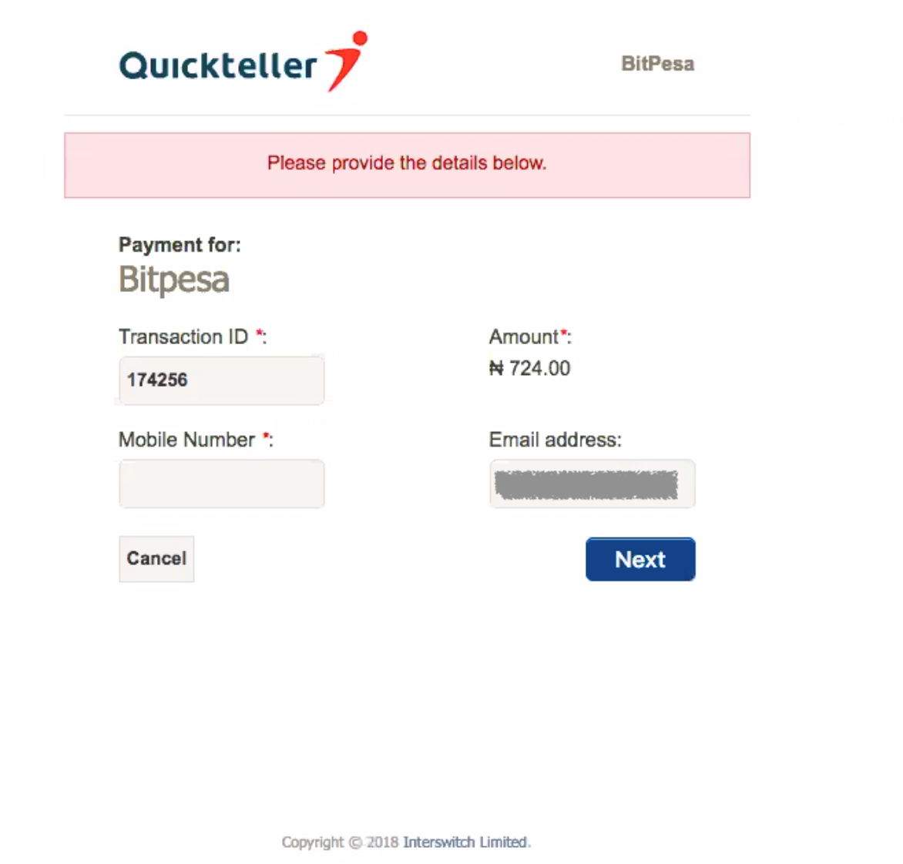
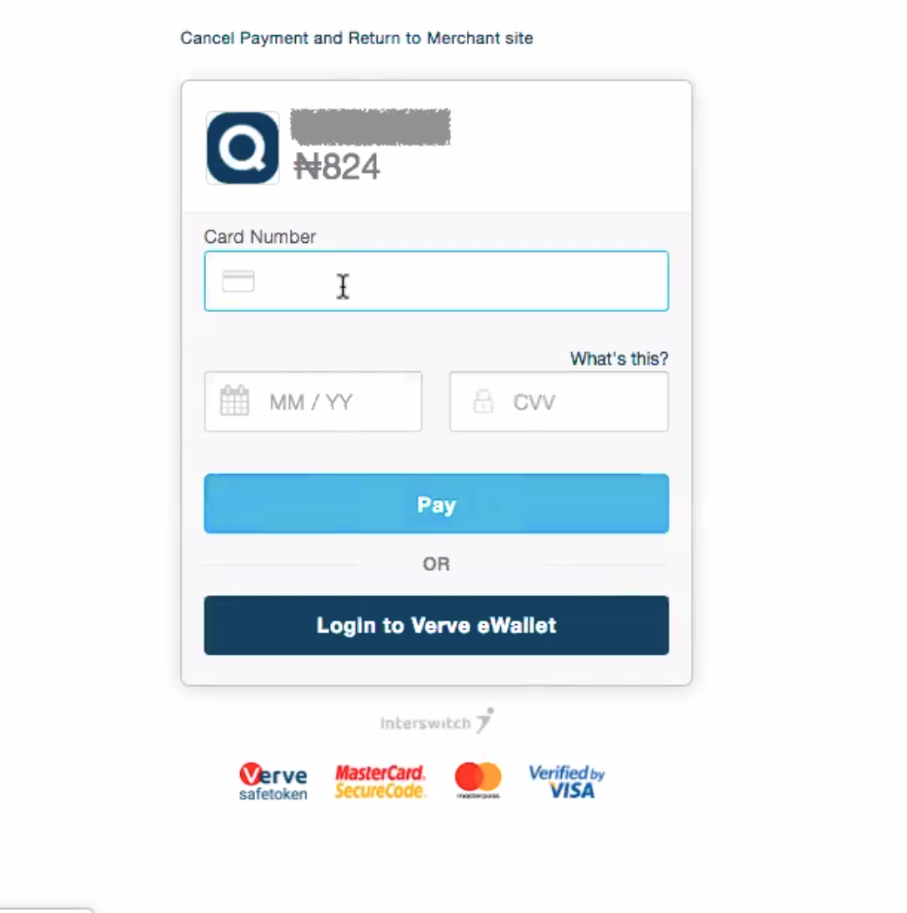
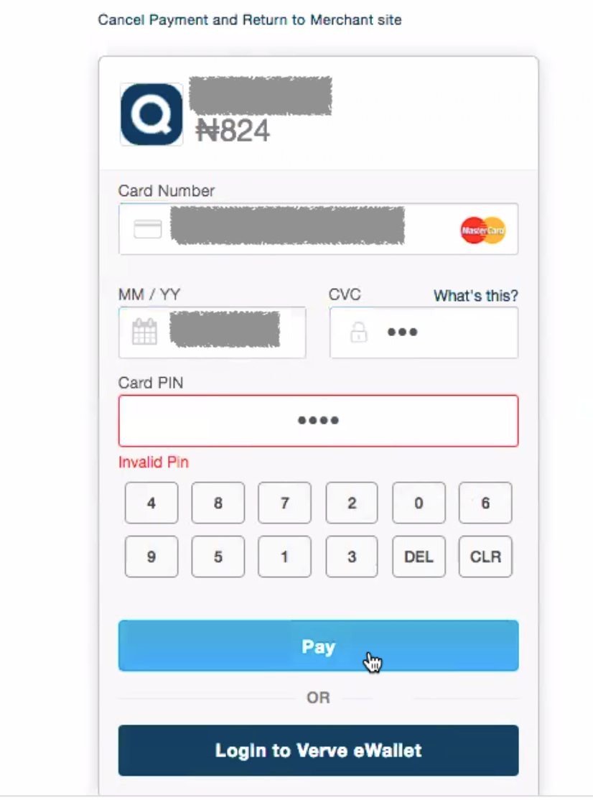
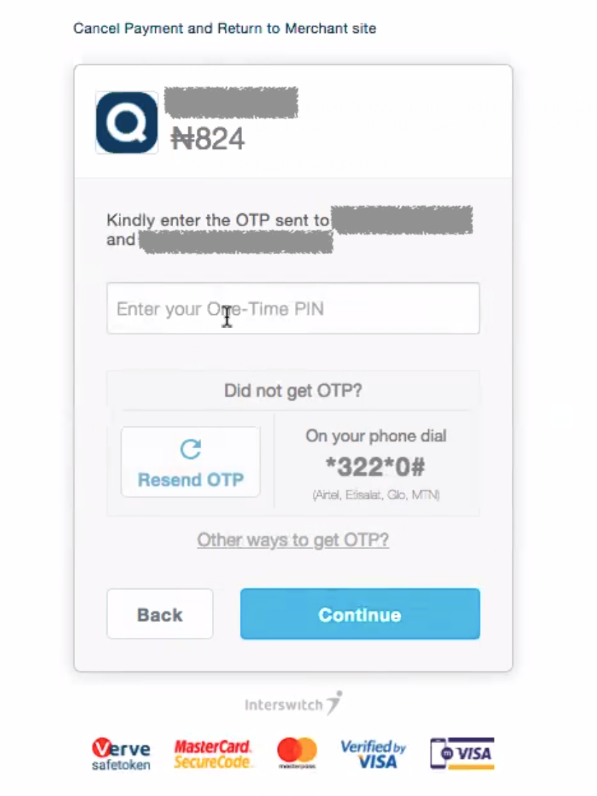
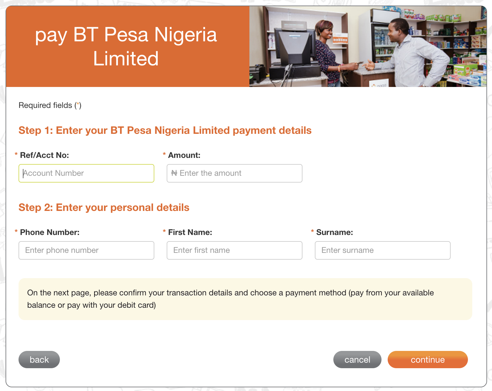
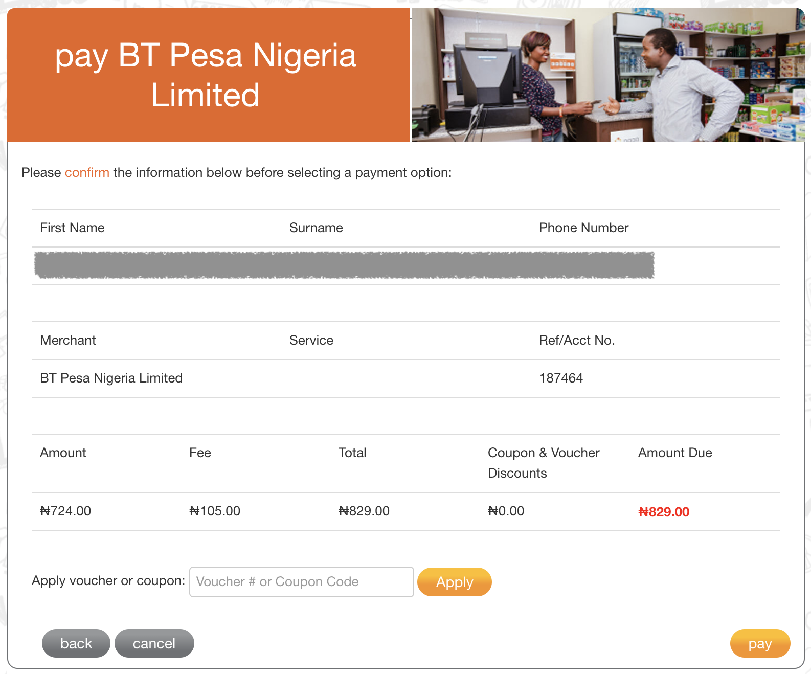
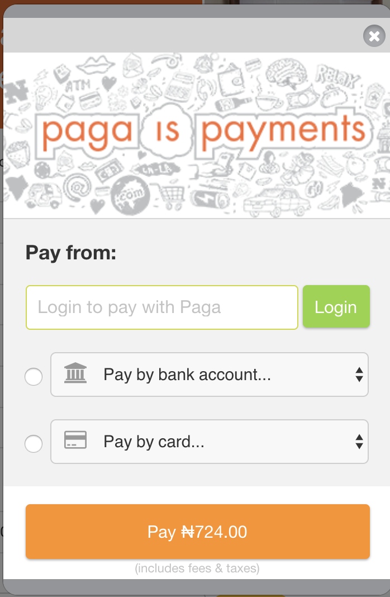
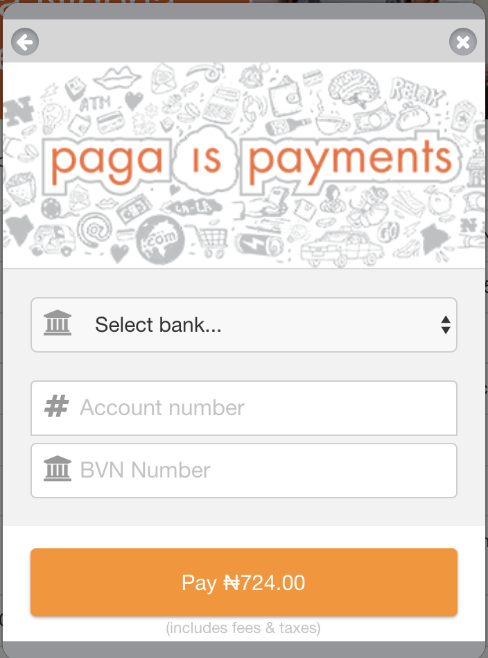
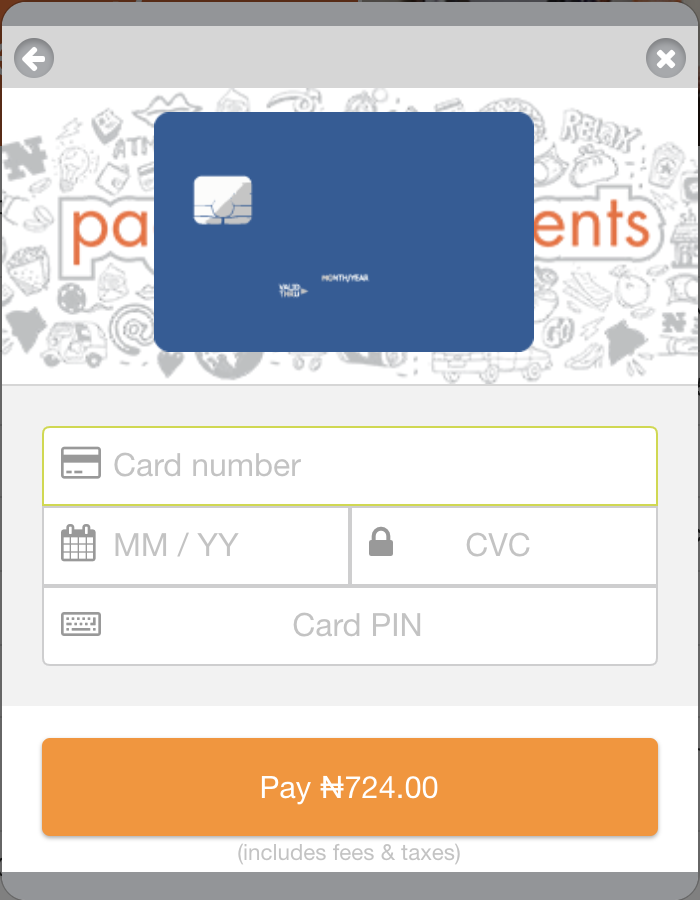

# Additional Features

- [Additional Features](#additional-features)
  - [Bank account name validation](#bank-account-name-validation)
  - [Collections from senders](#collections-from-senders)
    - [NGN card collection requests through Interswitch](#ngn-card-collection-requests-through-interswitch)
    - [NGN card and mobile collection requests through Paga](#ngn-card-and-mobile-collection-requests-through-paga)
    - [GHS mobile collections through Interpay](#ghs-mobile-collections-through-interpay)
    - [TZS and UGX mobile collection using Beyonic](#tzs-and-ugx-mobile-collection-using-beyonic)
    - [GBP and EUR IBAN collections](#gbp-and-eur-iban-collections)


## Bank account name validation

Since it's easy to mistype the account number for a recipient, we provide a feature where you can
request more details about an account number, before creating a transaction.

To do this initiate a call to the following endpoint:

```ruby
POST /v1/account_validations

{
  "bank_account": "12345678", # account number to query
  "bank_code": "000", # bank code to query - same codes are used as for creating the transactions
  "country": "NG"   # Only "NG" is supported for now
  "currency": "NGN" # Only "NGN" is supported for now
  "method": "bank"  # Only "bank" is supported for now
}
```

The response will either be a `200 OK`, and provide you with the account title:

```javascript
{
  "object": {
    "account_name": "Test User"
  }
}
```

Or a `422 Unprocessably Entity` status code, with an error description in the body:

```javascript
{
  "object": {
    "account_name": null
  },
  "meta": {
    "error": "Account Invalid"
  }
}
```

Once you have the account title you can compare that with the recipient details you wish to provide us, and only create a transaction if they match.

## Collections from senders

The BitPesa API can also be used to collect money from various senders. We currently support the following automated ways to collect money from the user:

* GHS mobile collections
* TZS mobile collections
* UGX mobile collections
* NGN mobile collections
* NGN card collections
* GBP bank collections through IBAN
* EUR bank collections through IBAN

The collected money can then be used to fund any of the an automated payout types (see the [transaction flow](transaction-flow.md)), or it can be used to fund a bank account. In the latter case payments will be aggregated and only sent out manually by our team once requested.

How to handle automated collection requests are based on the particular currency and type of collection.

You can also check the [API reference documentation](https://api.bitpesa.co/documentation#fetching-possible-payin-methods) for more details.

The generic structure of a transaction that collects the equivalent of 100 USD from senders and pays out to an USD bank account (that will be payed out manually by our team in bulk) looks like the following:

```javascript
{
  "input_currency": "NGN",
  "payin_methods": [
    // payin method details
  ],
  "sender": {
    // sender details
  },
  "recipients": [
    {
      "requested_amount": "100",
      "requested_currency": "USD",
      "payout_method": {
        "type": "USD::Manual::Bank",
        "details": {
          "first_name": "First",
          "last_name": "Last",
          "bank_code": "US Bank",
          "bank_account": "12345678",
          "bank_account_title": "First Last"
        }
      }
    }
  ],
  "metadata": {}
}
```

Please note that this is just an example, the `recipient` details, including the `requested_amount` and `requested_currency` can be modified based on the steps described at the [transaction flow](transaction-flow.md) documentation. You can also use any of the automated payout types instead of `USD::Manual::Bank`, in which case once we receive the funds the payment will be done automatically.

The response will always look like the following. It is very similar to the standard transaction response, but also contains details on how to handle the collection request:

```javascript
{
  "object": {
    "id":"xxxxxxxx",
    "state": "approved",
    "input_amount": 724.0,
    "input_currency": "NGN",
    "payin_reference": "119394",
    "sender": {
      // sender details
    },
    "payin_methods": [
      {
        "id": "xxxxxxxx",
        "type":"NGN::Bank",
        "out_details": {
          // The out_details hash contains instructions on how to finish the payment.
          // These values might change for each request and should never be cached.
        },
        "in_details": {
          // The input details as sent in the request
        },
        "instructions": {
          // In case there are specific instructions to follow they will appear here.
          // Compared to the details in `out_details` the instructions here are static,
          // and don't contain dynamic details, like reference numbers
        }
      }
    ],
    "recipients": [
      // recipient details
    ]
  }
}
```

Please note the `payin_reference` number, which should be used if the provider asks for a reference number whether it's bank, card or mobile payments. This number will be used to link together the collection with the transaction. Note that this might not always be a number - some providers will have alphanumeric values for example.

For the valid options in the `payin_methods` field please see the next sections

### NGN card collection requests through Interswitch

To initiate an NGN card collection through Interswitch please use the following details:

```javascript
"input_currency": "NGN",
"payin_methods": [
  {
    "type": "NGN::Bank",
    "in_details": {
      "redirect_url": "http://redirect.back.to"
    },
    "provider": "interswitch"
  }
],
```

Please note the `redirect_url` which has to be set to an URL where you wish the user to be redirected once the payment has either been done, or the request has been rejected by the user.

Once the transaction has been created the `out_details` will be:

```javascript
"out_details": {
  "style": "redirect",
  "url": "https://api.bitpesa.co/payin/interswitch/xxxxxxxx/yyyyyyyy"
}
```

In this case the user needs to be redirected to the url described at `url`.

Once they are redireted there they need to fill out their card details on the following pages.



The first page will be pre-filled with the sender's email address which can be updated, and the `payin_reference` number, which however should not be changed by the user!

Once the details are filled out the user will be redirected to the card payment pages:



Please note that here the amount also includes the 100 NGN card transaction fee as well. Dependent on the card the user might be required to enter their PIN number as well:



Once the details are filled out dependent on the card, the user might also be required to fill out a second factor verification site:



Once the details have been entered the user will be redirected back to the `redirect_url` URL that was set up in the request. If the transaction was successful we will send a `transaction.paid_in` webhook as well.

### NGN card and mobile collection requests through Paga

To initiate an NGN collection through Paga please use the following details:

```javascript
"input_currency": "NGN",
"payin_methods": [
  {
    "type": "NGN::Mobile",
    "provider": "paga"
  }
],
```

The `out_details` will be:

```javascript
"out_details":{
  "style": "info",
  "url": "https://www.mypaga.com/paga-web/customer/payMerchant/home?merchantId=2b38ad0a-30c8-428c-a38d-836035b58718",
  "Merchant": "BitPesa",
  "Reference": "187464"
}
```

The user should be sent to the URL provided where they have to enter the appropriate reference number, amount, and personal details to finish the payment.

Once the payment has been successfully done a `transaction.paid_in` webhook will be sent out.

The Paga payment process looks like the following:



Here the user has to enter the exact amount and reference number, as well as their phone number. These fields will not be pre-filled, so it's important that they are filled out by the customer properly otherwise the payments could not be linked to the transaction appropariately.

Once the details have been filled out there's a confirmation page:



And afterwards the user can choose how to pay the transaction. The options are mobile payments through paga:



Bank transfer:



Or card payments:



### GHS mobile collections through Interpay

To initiate a GHS mobile collections please use the following details:

```javascript
"input_currency": "GHS",
"payin_methods": [
  {
    "type": "GHS::Mobile",
    "in_details": {
      "phone_number": "+2569999999",
      "send_instructions": true
    },
    "provider": "interpay"
  }
],
```

Once the transaction is created the specified phone number will receive instructions on how to pay in the requested amount.

Please note that Interpay GHS Mobile collections does not work with Vodafone Cash. Also if the customer does not have enough funds to pay the transaction they might not receive the payment prompt to their phone. In this case the transaction request should be re-sent, once the customer has confirmed they have enough funds.

Once the payment has been successfully done a `transaction.paid_in` webhook will be sent out.

### TZS and UGX mobile collection using Beyonic

To initiate a GHS mobile collections please use the following details:

```javascript
"input_currency": "TZS", // or UGX
"payin_methods": [
  {
    "type": "TZS::Mobile", // or UGX::Mobile
    "in_details": {
      "phone_number": "+2559999999",
      "send_instructions": true
    },
    "provider": "beyonic"
  }
],
```

Once the transaction is created the specified phone number will receive instructions on how to pay in the requested amount.

If the user does not receive a prompt they are still able to finish the payment. Instructions can be found in the `payin_methods[0].instructions` hash in the following format:

(example instructions for TZS payments)

```javascript
"instructions": {
  "MPESA Code": "\\nDial *150*00#\\nSelect Option 4: Pay by M-Pesa\\nSelect Option 4: Enter Company Number\\nInput number: 400700\\nInput payment reference: 008bitpesa\\nInput payment amount\\nInput password\\n",
  "TIGO PESA Code": "\\nDial *150*01#\\nSelect Option 4: Payments\\nSelect Option 3: Enter Company Number\\nInput number: 400700\\nInput payment reference: 008bitpesa\\nInput payment amount\\nInput password\\n",
  "Airtel Code":"\\nDial *150*60#\\nChoose Number 5: Pay Bills\\nChoose Number 4: Input Company Name\\nInput name: Datavisint\\nInput payment amount\\nInput reference number: 008bitpesa\\nInput password\\n"
}
```

Once the payment has been successfully done a `transaction.paid_in` webhook will be sent out.

### GBP and EUR IBAN collections

To initiate GBP or EUR IBAN collections please use the following details:

```javascript
"input_currency": "GBP", // or EUR
"payin_methods": [
  {
    "type": "GBP::Bank", // or EUR::Bank
    "provider": "lhv"
  }
],
```

The user will then need to follow the instructions as shown in the response's `out_details` hash:

```javascript
"out_details": {
  "style": "info",
  "BIC": "LHVBEE22",
  "Bank Address": "Tartu mnt 2, 10145 Tallinn, Estonia.",
  "Account Name": "B TRANSFER SERVICES LIMITED",
  "IBAN": "EE087700771002673049",
  "Beneficiary Address": "Tax Assist Accountants, 64 Southwark Bridge Road, London SE1 0AS",
  "Reference": "PDTWTACVNTPC"
}
```

The user will then need to send the appropriate funds to the IBAN shown above, with the reference number used as "payment details". Note that IBAN  payments can take up to 5 business days to arrive. Once the payment has been received a `transaction.paid_in` webhook will be sent out.
